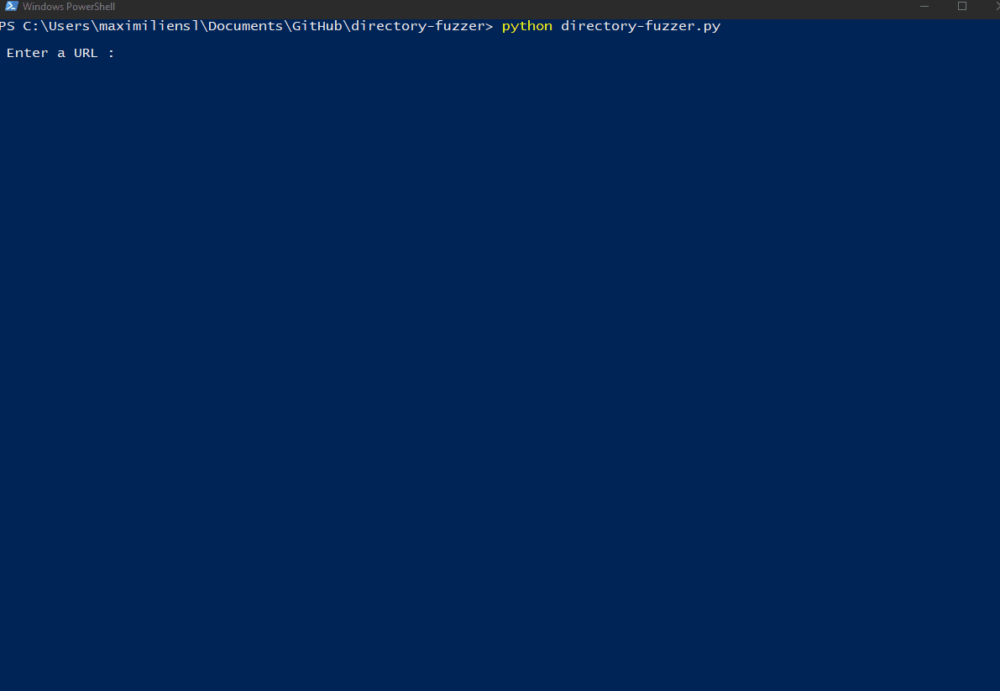

# Directory Fuzzer

## Preview

## How To Run This Program

First, make sure [Python 3.7+](https://www.python.org/downloads/) and [pip](https://pypi.org/project/pip/) are installed on your computer.

Then install the Requests module :

	pip3 install requests
  
Now run the program with the following command :

	python directory-fuzzer.py
  
## IMPORTANT NOTICE

This source code is meant for educational purposes only and should not be used for malicious activity.

## Description

This script finds resources on a remote host based on a word list provided as input.
